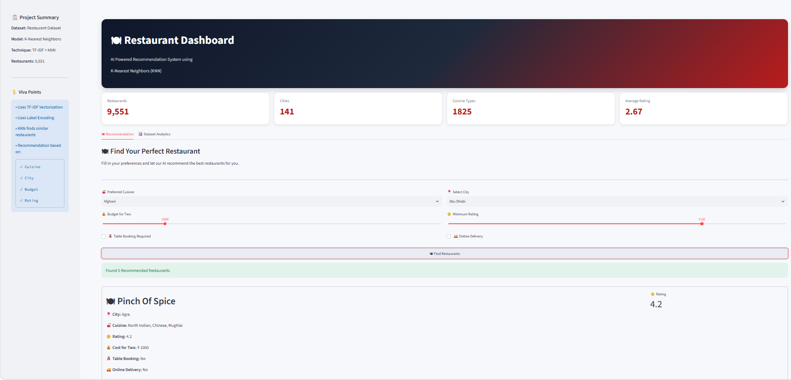

# 🍽 AI Restaurant Recommendation Dashboard

An interactive **Machine Learning-powered Restaurant Recommendation System** built using **Python, Streamlit, Scikit-Learn, and Plotly**. This application recommends restaurants based on user preferences such as **Cuisine, City, Budget, Rating, Table Booking, and Online Delivery** using the **K-Nearest Neighbors (KNN)** algorithm.

---

## 🚀 Live Demo

🔗 https://ai-restaurant-dashbaord-system.streamlit.app/

---

## 📂 GitHub Repository

🔗 https://github.com/mishraansh-dev/AI-Restaurant-Dashbaord-System.git

---

## 📖 Project Overview

This project is a content-based restaurant recommendation system that allows users to discover restaurants matching their preferences.

The application performs:

- Data Cleaning & Preprocessing
- Feature Engineering
- TF-IDF Vectorization
- Label Encoding
- K-Nearest Neighbors (KNN) Recommendation
- Interactive Streamlit Dashboard
- Dataset Analytics using Plotly

---

## ✨ Features

- 🍽 Restaurant Recommendation System
- 📍 City-wise Restaurant Search
- 🍜 Cuisine-based Recommendation
- 💰 Budget Selection
- ⭐ Rating Filter
- 🪑 Table Booking Filter
- 🚚 Online Delivery Filter
- 📊 Interactive Analytics Dashboard
- 📈 Plotly Visualizations
- 🎨 Modern Streamlit User Interface
- ☁️ Deployed on Streamlit Community Cloud

---

## 🤖 Machine Learning Workflow

```
Restaurant Dataset
        │
        ▼
Data Cleaning
        │
        ▼
Missing Value Handling
        │
        ▼
TF-IDF Vectorization (Cuisine)
        │
        ▼
Label Encoding (City)
        │
        ▼
Feature Matrix Creation
        │
        ▼
K-Nearest Neighbors (KNN)
        │
        ▼
Restaurant Recommendations
```

---

## 🛠 Technologies Used

### Programming Language
- Python

### Libraries
- Streamlit
- Pandas
- NumPy
- Scikit-Learn
- Plotly

### Machine Learning
- K-Nearest Neighbors (KNN)
- TF-IDF Vectorizer
- Label Encoder

---

## 📊 Dashboard Features

### 📌 Project Summary
- Restaurant Dataset Information
- ML Algorithm Details
- Recommendation Workflow

### 📈 KPI Cards
- Total Restaurants
- Total Cities
- Cuisine Types
- Average Rating

### 🍽 Recommendation Engine
Users can search restaurants using:
- Cuisine
- City
- Budget
- Rating
- Table Booking
- Online Delivery

### 📊 Analytics Dashboard
- Top Cities by Restaurants
- Rating Distribution
- Top Cuisine Types
- Online Delivery Availability
- Top Rated Restaurants

---

## 📸 Screenshots

### Dashboard



> Add additional screenshots inside the **screenshots** folder if available.

---

## 📂 Project Structure

```
AI-Restaurant-Recommendation-System
│
├── app.py
├── Dataset.csv
├── requirements.txt
├── README.md
├── .gitignore
├── Restaurant Recommendation System.ipynb
└── screenshots
    └── Restaurant_Dashboard.png
```

---

## ⚙️ Installation

Clone the repository

```bash
git clone https://github.com/mishraansh-dev/AI-Restaurant-Dashbaord-System.git
```

Move into the project folder

```bash
cd AI-Restaurant-Recommendation-System
```

Install dependencies

```bash
pip install -r requirements.txt
```

Run the application

```bash
streamlit run app.py
```

---

## 📈 Dataset Information

- Total Restaurants: **9,551**
- Cities: **141**
- Cuisine Types: **1,825**
- Recommendation Algorithm: **K-Nearest Neighbors (KNN)**

---

## 🔮 Future Enhancements

- Restaurant Images
- Google Maps Integration
- Distance-based Recommendation
- User Login System
- Favorite Restaurants
- Restaurant Reviews & Sentiment Analysis
- Deep Learning-based Recommendation Engine

---

## 👨‍💻 Developer

**Ansh Mishra**

B.Tech Information Technology (Data Science)

Ramrao Adik Institute of Technology

---

## ⭐ Support

If you found this project helpful, consider giving it a ⭐ on GitHub!

---

## 📜 License

This project is developed for educational and portfolio purposes.